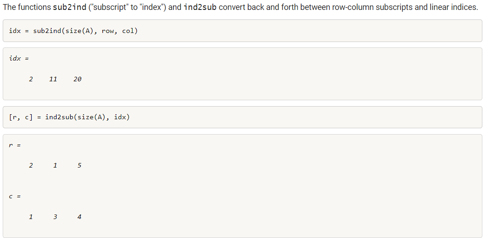

# 矩阵索引(向量化高速化中学到的)

https://ww2.mathworks.cn/company/technical-articles/matrix-indexing-in-matlab.html

https://blogs.mathworks.com/steve/2008/01/28/logical-indexing/?from=cn

matlab linear indexing a(17) actually means a(2,4)when a is a matrix of (5,5)

The functions sub2ind ("subscript" to "index") and ind2sub convert back and forth between row-column subscripts and linear indices
https://blogs.mathworks.com/steve/2008/02/08/linear-indexing/?from=cn

