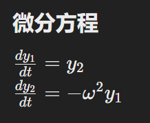

# ode45解微分方程

解如下微分方程



将harmonic_oscillator定义成微分方程，返回值为导数矩阵

```python
import pdb
from scipy.integrate import ode
import numpy as np

# 定义简单谐振子的微分方程
def harmonic_oscillator(t, y, omega):
    y1, y2 = y  # 解包状态变量，y1是位移，y2是速度
    dydt = [y2, -omega**2 * y1]  # 计算状态变量的导数
    return dydt

omega = 1.0  # 角频率
y0 = [1.0, 0.0]  # 初始条件 [y(0), dy/dt(0)]
t0 = 0  # 初始时间

solver = ode(harmonic_oscillator).set_integrator('dopri5')  # 设置求解器和积分器
solver.set_initial_value(y0, t0).set_f_params(omega)  # 设置初始条件和参数

t_end = 10  # 结束时间
dt = 0.1  # 时间步长

# 设置断点进行调试
pdb.set_trace()

while solver.successful() and solver.t < t_end:
    solver.integrate(solver.t + dt)  # 执行一个时间步的积分
    print(f't={solver.t:.2f}, y={solver.y[0]:.4f}, dy/dt={solver.y[1]:.4f}')  # 输出当前时间和状态

```
