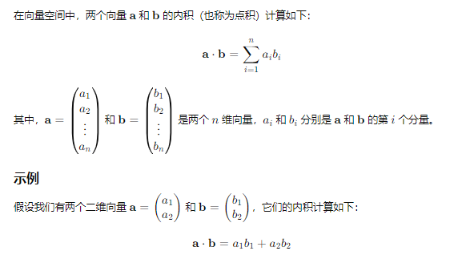

# PCA

1.计算每个维度的均值（eg二维）

2.计算协方差矩阵（二维的时候就是2*2，对角线上是方差）

3.计算协方差矩阵的特征值

4.反代入特征方程求解特征向量，特征向量仅代表方向，可以不止一个

5.按特征值从大到小分别是第一，第二主成分的特征向量

Q:求解这些点投影到第一主成分上的坐标

1.转换第一主成分对应的向量为单位向量i

2.P1的投影P1’即内积P1’=P1.*i

补充：

Q:投影之后生成的低维坐标再朝原高维坐标转换时产生的误差怎么算
在上面的基础上，再乘以一次该方向上的特征向量即可(需要是单位向量)
