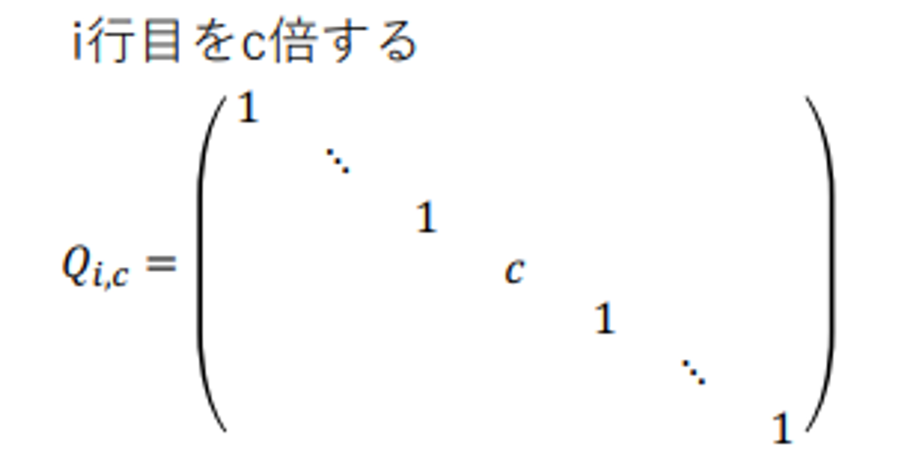
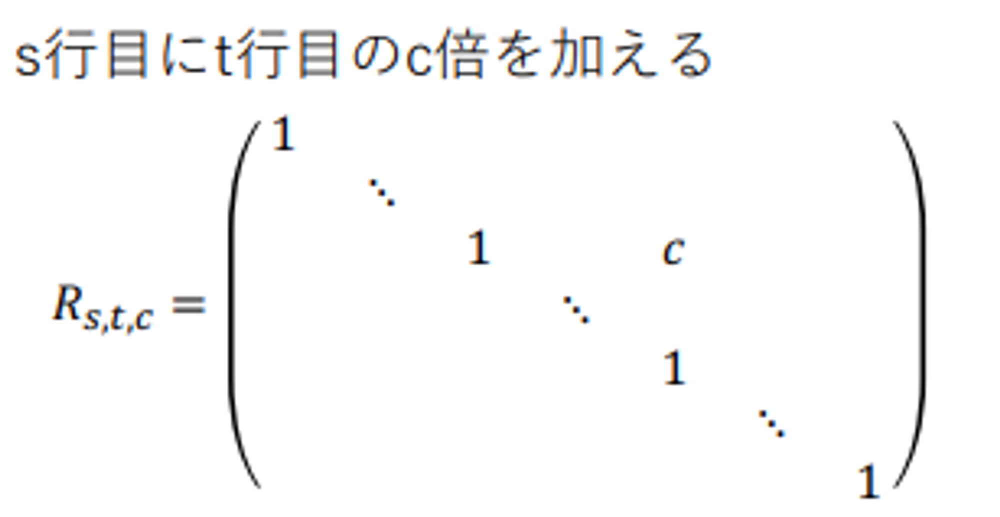
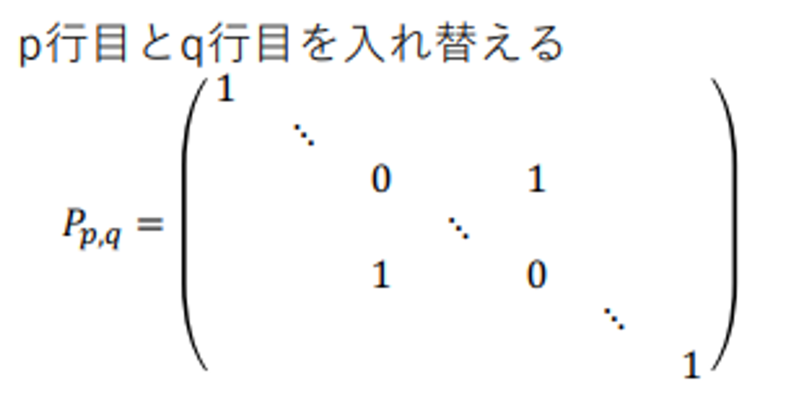
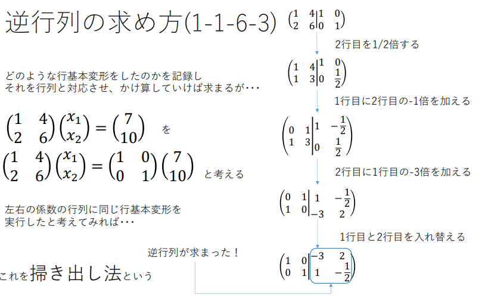

# 应用数学

矩阵变换本身可以表示成左乘一个相应的单位矩阵，这么累乘即可以将左边化成单位矩阵I

$$
IX=A^{-1}AX = A^{-1}B 

$$

---

## 矩阵求逆

由此思想衍生出来的求逆矩阵方法，通过矩阵变换将$(A|I)$转化成$(I|A^{-1})$

---

## 逆矩阵不存在的条件

也即原方程无解的情况，即某一行的i倍是另一行，此时通过矩阵变换使得其中一行为0，**原方程无解**。

引入行列式的概念，2D时就是向量构成的面积

而在求三阶行列式时可以通过展开成为三个二阶行列式

---

## 固有值,

"eigenvalue"  refers to a scalar λ that represents how a linear transformation, represented by a matrix, behaves along certain directions.

固有ベクトル

各々の固有値を連立方程式

***(A−λE)x=0***に代入して

解出来比如x1没有约束，那么固有ベクトル在这个方向上任意取值

其实一开始只需要将原矩阵对角线各-lamda就行，行列式为0,可以解出固有值。同时固有向量不唯一，乘上n倍都是。

---

中间是固有值的对角矩阵，两旁是固有向量构成的矩阵和它的逆矩阵

---

## 非正方行列の特異値分解

実数 *σ* を（ベクトル *u*, *v* に対応する）行列 *M* の**特異値** (singular value) と呼ぶ。またベクトル *u*, *v* を、それぞれ *σ* の**左特異ベクトル** (left-singular vector) と**右特異ベクトル** (right-singular vector) と呼ぶ。

