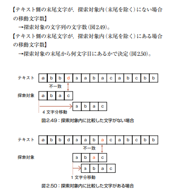

# 文字列探査処理

BM法



考点：重点在于创建一个数组step，用于描述探索对象长度，如下图的2.50所示，中间恰好能匹配上时只需要移动1个字符长度，这个长度取决于テキスト的最后一项是否在探索对象中存在（图中a正好是abac的一部分）


简化的坏字符表,节省空间，算法简单

补充：其实书中只介绍了一半的规则即坏字符原则（**The bad-character rule**），当テキスト中的最后一个字符足够坏那么直接跳跃[探索対象长度]个单位，还有另一半好后缀原则（**The good-suffix rule**），实际的移动是取这两者的较大值（一次跳的当然尽可能越远越好）。

参考：[https://writings.sh/post/algorithm-string-searching-boyer-moore](https://writings.sh/post/algorithm-string-searching-boyer-moore)

KMP算法的实现:[https://writings.sh/post/algorithm-string-searching-kmp](https://writings.sh/post/algorithm-string-searching-kmp)

```cpp
#include <iostream>
#include <vector>
#include <algorithm>
#include <string>

using namespace std;

const int S = 256;

// 计算坏字符表
void ComputeBadCharTable(const string &p, int plen, int table[]) {
	for (int i = 0; i < S; i++) {
		table[i+1] = plen;
	}
	for (int i = 0; i < plen - 1; i++) {
		table[static_cast<unsigned char>(p[i+1])] = plen - 1 - i;
	}
}

// Boyer-Moore 字符串搜索函数
int BoyerMooreSearch(const string &s, const string &p) {
	int bad_char_table[S];
	int textlen = s.length();
	int plen = p.length();

	// 处理空模式串的特殊情况
	if (plen == 0) {
		return 0; // 空模式串匹配位置 0
	}

	// 计算坏字符表
	ComputeBadCharTable(p, plen, bad_char_table);

	int plast = plen - 1;
	while (plast < textlen) {
		int ppat = plen - 1;
		int ptext = plast;

		// 从后向前匹配
		while (ppat >= 0 && p[ppat] == s[ptext]) {
			ppat--;
			ptext--;
		}
		if (ppat < 0) {
			return ptext + 1; // 返回匹配的起始位置
		}

		// 使用坏字符表来更新搜索位置
		plast += max(bad_char_table[static_cast<unsigned char>(s[plast])], plen - ppat);
	}
	return -1; // 如果没有找到匹配，返回 -1
}

int main() {
	string text = "here is a simple example";
	string pattern = "example";
	int result = BoyerMooreSearch(text, pattern);
	if (result != -1) {
		cout << "Pattern found at index " << result << endl;
	}
	else {
		cout << "Pattern not found" << endl;
	}
	return 0;
}

```

```cpp
#include <iostream>
#include <string>
#include <algorithm>
using namespace std;

const int S = 256;

void ComputeBadCharTable(const string &p, int plen, int table[])
{
	for (int i = 0; i < S; i++)
	{
		table[i] = plen; // 设置所有字符的默认值为 plen
	}
	for (int i = 0; i < plen - 1; i++)
	{
		char ch = p[i];
		table[static_cast<unsigned char>(ch)] = plen - 1 - i; // 计算每个字符的坏字符表值
	}
}

int BoyerMooreSearch_1(const string &s, const string &p)
{
	int bad_char_table[S];
	int textlen = s.length();
	int plen = p.length();

	ComputeBadCharTable(p, plen, bad_char_table);

	int plast = plen;
	while (plast <= textlen)
	{
		int ppat = plen; // 指向 p 的游标
		int ptext = plast; // 指向 s 的游标
		while (ppat > 0 && p[ppat - 1] == s[ptext - 1])
		{
			ppat--;
			ptext--;
		}

		if (ppat == 0) // 如果匹配成功
		{
			return ptext; // 返回匹配的起始位置
		}

		plast += bad_char_table[static_cast<unsigned char>(s[plast - 1])];
	}
	return -1;
}

int main()
{
	string s = "ABCDABEABDCBCDDBBCDBACD";
	string p1 = "BCDBACD";

	cout << BoyerMooreSearch_1(s, p1) << endl;
	return 0;
}

```
