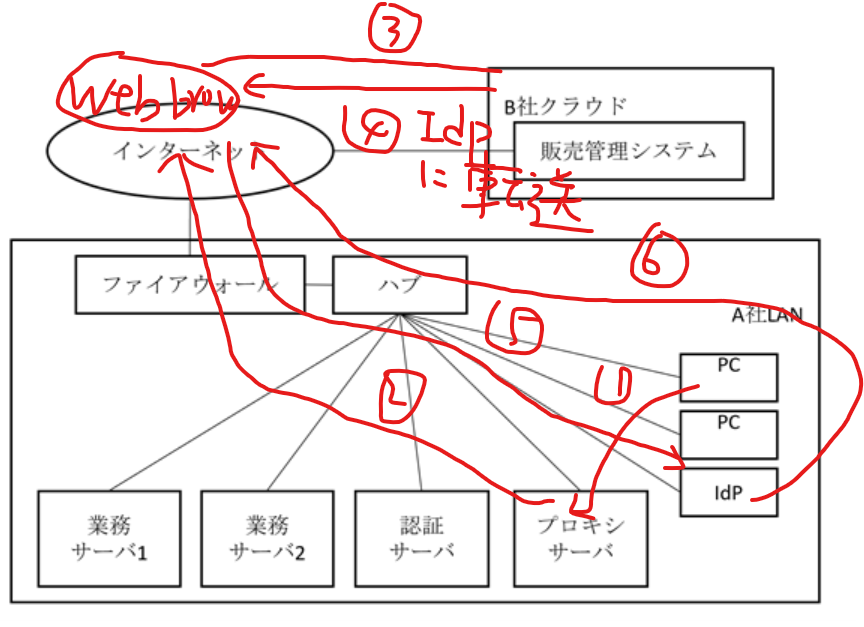

# 一个identity provider的例子

A 社 LAN から社外への通信は、 PC からプロキシサーバを経由した HTTP および HTTPS による通信、およびその応答だけが、ファイアウォールによって許可されている。社外から A 社 LAN への通信は、すべてファイアウォールによって禁止されている。

利用者は、業務システムおよび販売管理システムを A 社 LAN に設置された PC の Web ブラウザから利用する。業務システムおよび販売管理システムの利用者認証は、認証サーバでの利用者 ID とパスワード（以下、利用者認証情報という）の検証によって行っており、シングルサインオンを実現している。

社内 LAN内に設置した IdP（ Identity Provider ） は、社外にある販売管理システムの利用のため、利用者認証を仲介する ID プロバイダである。利用者は、 Web ブラウザから B 社クラウドにアクセス要求を送信すると、 B 社クラウドはアクセス要求を IdP に転送する指示を応答する。 Web ブラウザがこの指示に従って IdP にアクセス要求を行うと、 IdP が利用者認証の画面を Web ブラウザに応答する。 IdP で認証が成功すると、 B 社クラウドを利用できる。

B 社クラウドでは、接続元の IP アドレスを A 社 のものに制限する機能は提供されていない。しかし、他の業務システムと同様に、 B 社クラウドを、 A 社 LAN からの利用に限定できる。この理由は、Web ブラウザが、 IdP と通信する(图中5只能在a向外通信的应答时实现)ことが必要であるが、 IdP を A 社 LAN に設置するので、社外から B 社クラウドを利用しようとしても、利用者認証されないからである。

