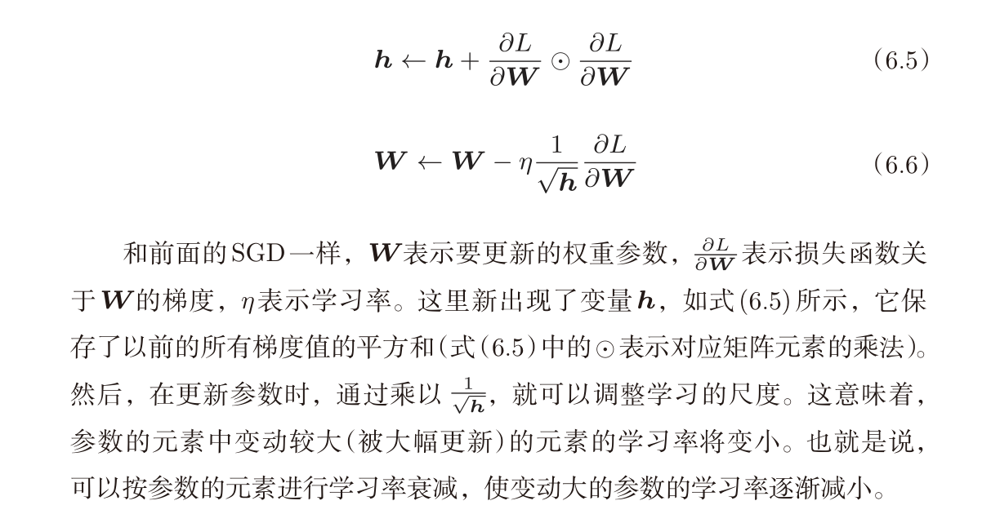

# AdaGrad

## Shortage:

**AdaGrad** 确实有可能在还没到达损失函数的最小值时就停下来。这主要是因为 AdaGrad 的学习率会随着迭代次数增加而逐渐减小，甚至变得非常小，导致后期参数更新非常缓慢，无法有效地继续向最小值靠近。

原因是 AdaGrad 会对每个参数的梯度进行累积计算，公式中的累积项 Gt 会随着训练的进行不断增大，导致学习率 $\frac{\eta}{\sqrt{G_t} + \epsilon}$变得越来越小。因此，虽然一开始能快速下降，但当学习率过小的时候，参数更新速度会变得非常慢，甚至停滞。

### 这种情况的后果包括：

- **无法到达全局最小值**：如果梯度在后期仍然存在，但是由于学习率太小，参数更新步伐变得极慢，模型可能在一个次优解附近停滞，而无法继续向全局最优解靠近。
- **早停现象**：尤其在高维优化问题中，参数更新的速度极度减缓，可能在达到较低损失的局部区域后几乎停滞。

### 解决方法：

为了解决这个问题，通常会使用一些 AdaGrad 的改进版本，例如：

1. **RMSProp**：RMSProp 引入了指数加权平均，防止累积的梯度平方无限增大，从而让学习率不会降低得过快。
2. **Adam**：Adam 结合了 RMSProp 和动量法的优点，能够在整个训练过程中保持一个合适的学习率，不会像 AdaGrad 那样迅速减小学习率。

