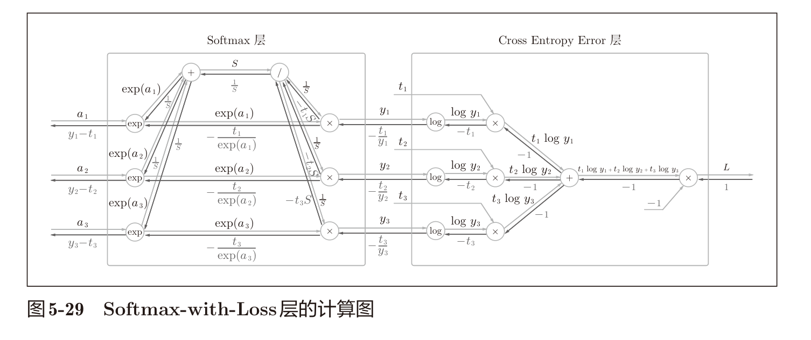

# Softmax-with-Loss

### 漂亮的反向传播，注意此处从softmax反馈的值是y-t

### 回归问题中输出层使用“恒等函数”，损失函数使用
“平方和误差”，也是出于同样的理由（3.5节）。也就是说，使用“平
方和误差”作为“恒等函数”的损失函数，反向传播才能得到（y1 −
t1, y2 − t2, y3 − t3）这样“漂亮”的结果

---

## 损失函数最小→沿着梯度下降→正好在这里反向传播时式子是y-t→设计的好可以直接利用实际值y和标签值t的差分来衡量是否达到极值点

[**y差分的最小化等价于损失函数的最小化**](y%E5%B7%AE%E5%88%86%E7%9A%84%E6%9C%80%E5%B0%8F%E5%8C%96%E7%AD%89%E4%BB%B7%E4%BA%8E%E6%8D%9F%E5%A4%B1%E5%87%BD%E6%95%B0%E7%9A%84%E6%9C%80%E5%B0%8F%E5%8C%96.md)

---

[Improved 2-layer](Improved%202-layer/%E7%B4%A2%E5%BC%95.md)
