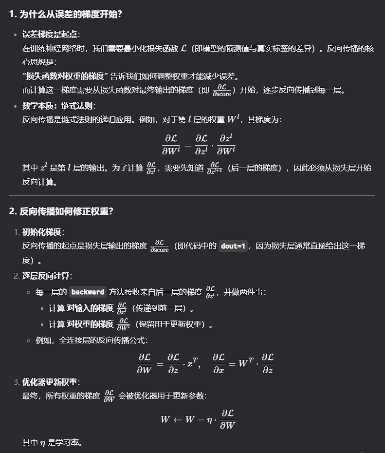

# 正向传播和反向传播的实质(简)

```python
def predict(self, x):
        for layer in self.layers:
            x = layer.forward(x)
        return x

    def forward(self, x, t):
        score = self.predict(x)
        loss = self.loss_layer.forward(score, t)
        return loss

    def backward(self, dout=1):
        dout = self.loss_layer.backward(dout)
        for layer in reversed(self.layers):
            dout = layer.backward(dout)
        return dout
```

### **1. `predict(x)` 方法**

- **功能**：输入数据 **`x`**，通过神经网络的每一层逐层计算，输出最终的预测结果（得分/ logits）。
- **流程**：
    1. 遍历模型的所有层（**`self.layers`**）。
    2. 对输入 **`x`** 依次调用每一层的 **`forward`** 方法，得到当前层的输出，并作为下一层的输入。
    3. 返回最后一层的输出（即模型的预测结果 **`score`**）。
- **用途**：
    
    用于推理阶段（如测试或部署），不计算损失，仅输出预测值。
    

---

### **2. `forward(x, t)` 方法**

- **功能**：完成完整的前向传播，并计算损失（用于训练）。
- **参数**：
    - **`x`**：输入数据。
    - **`t`**：目标标签（ground truth）。
- **流程**：
    1. 调用 **`predict(x)`** 得到预测值 **`score`**。
    2. 将 **`score`** 和标签 **`t`** 传入损失层（**`self.loss_layer`**），调用其 **`forward`** 方法计算损失值（如交叉熵损失、均方误差等）。
    3. 返回损失值 **`loss`**。
- **用途**：
    
    训练时使用，前向传播后需接反向传播（**`backward`**）来更新权重。
    

---

### **3. `backward(dout=1)` 方法**

- **功能**：反向传播误差梯度，更新模型参数。
- **参数**：
    - **`dout`**：梯度初始值（默认为 1，通常从损失层开始反向传播）。
- **流程**：
    1. 调用损失层的 **`backward`** 方法，计算损失对最后一层输出的梯度 **`dout`**。
    2. **逆序**遍历所有层（**`reversed(self.layers)`**），依次调用每一层的 **`backward`** 方法，计算并传递梯度。
    3. 返回最后一层的输入梯度（可选，某些框架可能需要）。
- **关键点**：
    - 反向传播的顺序必须与前向传播相反（链式法则）。
    - 每一层的 **`backward`** 会计算：
        - 对输入的梯度（传递到前一层）。
        - 对参数的梯度（用于优化器更新权重，如 SGD、Adam）。

---

### 



### **3. 直观类比**

想象你在一座迷宫中寻找宝藏（最小化损失）：

- **前向传播**：你从入口走到某个位置（预测），记录路径（每一层的计算）。
- **反向传播**：你发现宝藏不在终点，于是从终点开始，沿着原路返回（反向传播梯度），并在每个岔路口（权重）标记“应该往哪边走更接近宝藏”（梯度方向）。
- **修正权重**：根据标记调整所有岔路口的方向（更新权重），下次走更优的路径。
