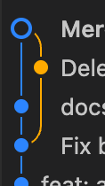

# git/github

[基本知识](%E5%9F%BA%E6%9C%AC%E7%9F%A5%E8%AF%86/%E7%B4%A2%E5%BC%95.md)

[git branch](git%20branch.md)

[实操](%E5%AE%9E%E6%93%8D.md)

[其他操作](%E5%85%B6%E4%BB%96%E6%93%8D%E4%BD%9C/%E7%B4%A2%E5%BC%95.md)

[rebase(压平历史成直线),merge(整理历史,vscode pull from all 自带),revert(撤回push),reset（撤回本地commit）](rebase%28%E5%8E%8B%E5%B9%B3%E5%8E%86%E5%8F%B2%E6%88%90%E7%9B%B4%E7%BA%BF%29,merge%28%E6%95%B4%E7%90%86%E5%8E%86%E5%8F%B2,vscode%20pull%20from%20all%20%E8%87%AA%E5%B8%A6.md)

---

[commit info规范](commit%20info%E8%A7%84%E8%8C%83.md)

[PR](PR/%E7%B4%A2%E5%BC%95.md)

[拷加密项目(ssh)](%E6%8B%B7%E5%8A%A0%E5%AF%86%E9%A1%B9%E7%9B%AE%28ssh%29/%E7%B4%A2%E5%BC%95.md)

[clone之后想要更新](clone%E4%B9%8B%E5%90%8E%E6%83%B3%E8%A6%81%E6%9B%B4%E6%96%B0.md)

[github项目使用-html](github%E9%A1%B9%E7%9B%AE%E4%BD%BF%E7%94%A8-html.md)

---

[为什么远程仓库默认叫 `origin`？](%E4%B8%BA%E4%BB%80%E4%B9%88%E8%BF%9C%E7%A8%8B%E4%BB%93%E5%BA%93%E9%BB%98%E8%AE%A4%E5%8F%AB%20origin%EF%BC%9F.md)

[几种特殊的回退操作](%E5%87%A0%E7%A7%8D%E7%89%B9%E6%AE%8A%E7%9A%84%E5%9B%9E%E9%80%80%E6%93%8D%E4%BD%9C.md)

[git workflow](git%20workflow.md)

[github action ](github%20action.md)

---

```markdown
#想要安全地查看别人的分支
git status
git branch -vv

git fetch origin
git stash
git checkout -b tmp_branch origin/<colleague_branch>
git checkout <your_branch>
git stash pop
```

---

## 代码解读

```jsx
git pull --no-rebase origin feature/template-matching
背景：我在review时手动删除了某个文件，但是本地没同步，导致本地提交新commit的时候冲突

git pull: 这是组合拳，等于 git fetch（下载代码） + git merge（合并代码）。

--no-rebase (核心重点):

这个参数告诉 Git：“千万别给我变基（Rebase）！哪怕我的配置里默认开启了 Rebase，这次也必须用 Merge。”

这意味着，如果你的代码和远程的代码有冲突或分叉，Git 会创建一个全新的“Merge Commit”（提交信息通常是 Merge branch '...' of ...），在你的提交历史中形成一个“菱形”的环路。

origin: 远程仓库的名字（默认通常叫 origin）。

feature/template-matching: 你要拉取的远程分支的名字。如右图
```


