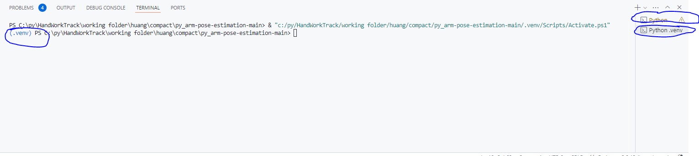

# Package Control

---

pyenvを使ってpythonのversionを指定できる。

powershellでpyenvをinstallする

[https://github.com/pyenv-win/pyenv-win](https://github.com/pyenv-win/pyenv-win)

```python
Invoke-WebRequest -UseBasicParsing -Uri "https://raw.githubusercontent.com/pyenv-win/pyenv-win/master/pyenv-win/install-pyenv-win.ps1" -OutFile "./install-pyenv-win.ps1"; &"./install-pyenv-win.ps1"
```

---

```python
pyenv --version
```

切换到working directory

安装python并指定python版本

```python
pyenv install 3.12.2
pyenv versions#查看所有可用版本
pyenv local 3.12.2
```

（今のworking folderに.python-versionというファイルが自動生成する）

---

pip使って、指定のpackageをinstallする

```python
python -m venv .venv
.venv\Scripts\activate

```

```python
pip install .#存在setup.cfg/pyproject.toml
pip install -r requirements.txt
```

[`pip install -e .和pip install .的区别`](pip%20install%20-e%20%E5%92%8Cpip%20install%20%E7%9A%84%E5%8C%BA%E5%88%AB.md)

---

attention!



上述的vscode才算是在venv启动状态，哪怕设定了python解释器也只是脚本运行的解释器，而不是全局环境下Vscode的解释器，也就是说随便打开一个终端无论路径在哪，使用python的话默认都是system path中的python，安装环境也会安装到那去！！！！

### 也就是说终端显示的路径和当前处于的环境完全独立，并不是说在venv文件夹或者在同一个working文件夹就默认调用其venv，要手动启用！！！

---
