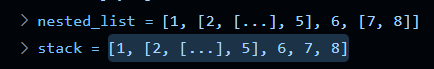

# 展平嵌套列表(flatten化)

在 Python 中，"flatten" 函数用于将嵌套列表（即包含子列表的列表）展平为一个单一的列表。下面是一个示例函数，展示如何递归地展平嵌套列表：

### 递归方法

```python
def flatten(nested_list):
    flat_list = []
    for item in nested_list:
        if isinstance(item, list):# 检查 item 是否是列表
            flat_list.extend(flatten(item))# 递归地展平子列表并添加到 flat_list
        else:
            flat_list.append(item)
    return flat_list

# 示例
nested_list = [1, [2, [3, 4], 5], 6, [7, 8]]
flattened = flatten(nested_list)
print(flattened)  # 输出: [1, 2, 3, 4, 5, 6, 7, 8]

```

### 非递归方法（使用堆栈）



```python
def flatten(nested_list=None):
    if nested_list is None:
        nested_list=[]
    flat_list = []
    stack = list(nested_list)#如果参数已经是一个列表，list 函数会创建并返回该列表的一个浅拷贝。这意味着新列表包含与原列表相同的元素，但它是一个新的对象，占用不同的内存空间。
    while stack:
        item = stack.pop()
        if isinstance(item, list):
            stack.extend(item)#list 的 extend 方法用于将一个可迭代对象（如列表、元组、字符串等）中的所有元素添加到列表的末尾。extend 方法会直接修改原列表，而不会创建新的列表。
        else:
            flat_list.append(item)
    flat_list.reverse()  # 后进先出，反转列表
    return flat_list

nested_list = [1, [2, [3, 4], 5], 6, [7, 8]]
flattened = flatten(nested_list)
print(flattened)  # 输出: [1, 2, 3, 4, 5, 6, 7, 8]
nested_list[3][1]=100
print(nested_list)
print(flattened)  # 输出: [1, 2, 3, 4, 5, 6, 7, 8]
```

### 使用生成器

生成器方法可以在处理大数据集时节省内存，因为它是逐个生成元素的，而不是一次性生成整个列表。

```python
def flatten(nested_list):
    for item in nested_list:
        if isinstance(item, list):
            yield from flatten(item)#继续交给下一个迭代器干活
        else:
            yield item

# 示例
nested_list = [1, [2, [3, 4], 5], 6, [7, 8]]
flattened = list(flatten(nested_list))
print(flattened)  # 输出: [1, 2, 3, 4, 5, 6, 7, 8]

```

### 使用 itertools 模块

`itertools` 模块提供的 `chain.from_iterable` 方法可以用于展平嵌套的可迭代对象。

```python
from itertools import chain

def flatten(nested_list):
    return list(chain.from_iterable(
        flatten(item) if isinstance(item, list) else [item] for item in nested_list))

# 示例
nested_list = [1, [2, [3, 4], 5], 6, [7, 8]]
flattened = flatten(nested_list)
print(flattened)  # 输出: [1, 2, 3, 4, 5, 6, 7, 8]

```

### 选择合适的方法

- **递归方法** 简单直观，但对深度嵌套列表可能会导致递归深度超限。
- **非递归方法** 使用堆栈处理深度嵌套列表，但代码稍复杂。
- **生成器方法** 对于大数据集节省内存，适合处理流式数据。
- **itertools 模块方法** 简洁但需要导入额外的模块。
