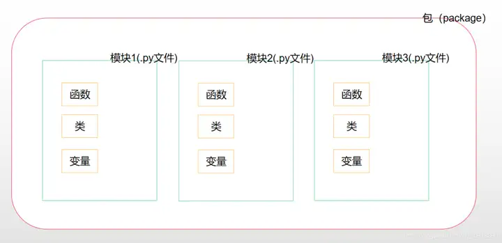

# module,package,library

[https://www.zhihu.com/question/30082392](https://www.zhihu.com/question/30082392)

. 是当前目录

.. 是当前目录的上级目录

---

[_ _ init _ _.py文件](_%20_%20init%20_%20_%20py%E6%96%87%E4%BB%B6.md)

[顶级脚本Top-Level Script](%E9%A1%B6%E7%BA%A7%E8%84%9A%E6%9C%ACTop-Level%20Script.md)
