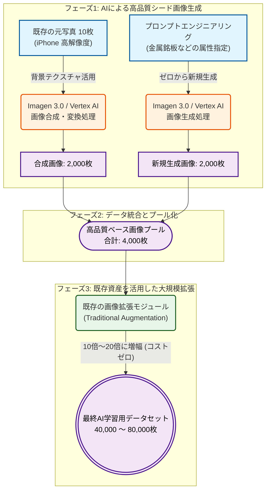

# Gemini API導入および画像データ拡張パイプラインに関する提案

## 1. API見積もりと予算確保について
今回の画像生成において、全てをGeminiの合成で賄うわけではありませんが、現在Gemini APIの利用推進を始めている背景があります。
今後、別のPoCやデモ制作の過程でもGeminiでのアプローチを試す機会が増えると予想されるため、今回少し予算枠を確保しておきたいと考えています。
* **概算見積もり:** 月額 600ドル程度
* **目安:** 1K解像度の画像で約10,000枚の生成相当

## 2. 画像データ拡張のアプローチ（ハイブリッド方式）
今回の画像拡張は、すべてをAI合成に頼るのではなく、以下のハイブリッド方式で進めることを検討しています。
1. **既存背景の活用:** 既存の元写真10枚を背景テクスチャとして使用し、Geminiで画像を合成して2,000枚に増やす。
2. **プロンプトによる生成:** プロンプトを使用して、類似の背景テクスチャ（金属銘板の属性など）を持つ画像を新たに2,000枚合成する。
3. **既存モジュールによる拡張:** 上記で得た合計4,000枚の画像に対して、**以前作成済みの画像拡張（Augmentation）処理**を適用し、最終的に10倍〜20倍の枚数のデータセットを取得する。

## 3. オープンソースとの比較およびトークン節約の最適化案
現在判明していることとして、既存のオープンソースの処理手法（AnyText2やFluxTextなど）は、文字周辺のテクスチャや背景の自然な処理において、どうしてもGeminiの精度には及びません。
* **最適化案:** コストを抑えるため、画像全体を生成するのではなく、**文字周辺の限定的なROI領域（非常に小さな範囲）のGlyph画像のみをGeminiで生成する**アプローチを検討します。
* **目的:**
  生成する画像解像度を小さくすることでトークンを節約できるため、実際のトークン消費量を観察・検証しながら、最もコストパフォーマンスの良い最適解を見つける予定です。

## 4. 新規マルチモーダルモデル登場による最適化の可能性
まさにこの報告をまとめている最中に、Googleから新しいマルチモーダルEmbeddingモデルが発表されました。これは、今後は動画や画像もテキストと同じように直接ベクトル化して扱えることを意味します。
* **期待されるメリット:**
  例えば以前、AnyTextを使用する際に「BLIPモデルを使って画像のテキスト出力（キャプション）を行い、それを生成モデルに入力する」というステップを踏んでいましたが、新モデルの活用により、こうした冗長な手順が不要になる可能性があります。
* 新モデルを使って最適化・検証できる余地が多数あるため、これらに備えて試せる環境（API予算）を確保しておくのが望ましいと考えています。

---

## ネクストアクション (TODO)
- [ ] **1. API生成精度の検証:** Geminiは生成時に「数字の桁数を間違える」ことがあるため、まずはAPI経由で生成された画像の精度を検証する。
>[!example]- example generated by Nano Banana(Gemini 2.5 Flash Image)
>

- [ ] **2. システムへの統合:** 検証したAPIのコードを現在のシステムに組み込み、既存の画像拡張モジュールとマージ（統合）する。