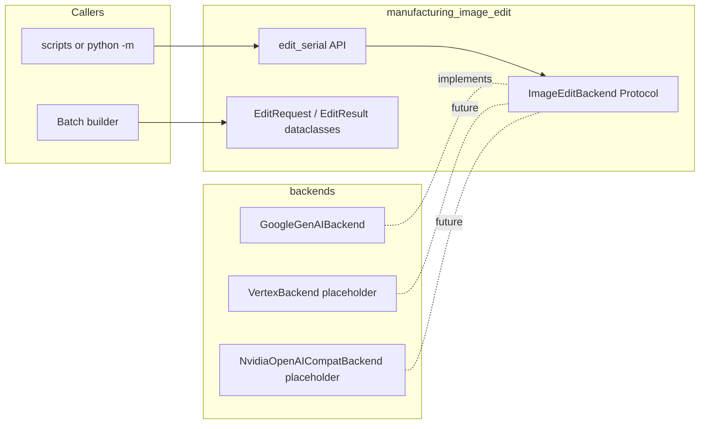

---

name: 製造番号图像编辑模块

overview: 在仓库内新增独立 Python 子包：通过抽象后端接口接入 Google GenAI（Gemini 图像编辑/生成能力），用环境变量与 `.env.example` 管理密钥；同步路径用于联调，稳定后复用同一请求结构对接 Gemini Batch API 以降低成本；结构便于日后换 Vertex AI 或 NVIDIA/OpenAI 兼容端点。

---

  

# 製造番号图像编辑模块（Google API + 可扩展后端 + Batch）

  

## 背景与约束

  

- 仓库现状：[pyproject.toml](pyproject.toml) 使用 `packages = []` 禁用自动发现；业务脚本在 [scripts/](scripts/)，尚无顶层 `src/` 业务包；根 [.gitignore](.gitignore) **未**包含 `.env`，需在实现时补上以免误提交密钥。

- 你的目标：把图中「製造番号」旁的英数字改为**自定义**英数字；配置经 `**.env.example`（入库）+ 本地 `.env`（不入库）**；后端将来可能换 Vertex AI 或 NVIDIA；模块可**拆到别的项目**；联调通过后希望用 **Batch** 降本（Gemini Batch 相对同步约 **50% 价**，适合非实时大批量）。

  

## 推荐 API 形态（Google 侧）

  

- 使用官方 `**google-genai`**（统一客户端）：Developer API（`GOOGLE_API_KEY`）与 Vertex（`vertexai` + 项目/区域）在 SDK 层可共用同一套 `generate_content` / Batch 调用模式，迁移时主要变**初始化参数**而非业务编排逻辑。

- 图像编辑：按当前文档走 **多模态生成**（输入图 + 文本指令，`response_modalities` 含 `IMAGE`），模型名用环境变量配置（如 `gemini-2.5-flash-image` 等预览模型），避免写死在代码里；具体以 [Gemini image generation 文档](https://ai.google.dev/gemini-api/docs/image-generation) 为准并在 README/注释中留链接。

  

> 说明：纯「提示词整图编辑」对复杂版式可能不稳定；若后续精度不足，可在同一 `ImageEditBackend` 内增加「可选 bbox/mask」参数，或与现有 PaddleOCR 检测框结合——**首版可先只做全图指令编辑**，不把 OCR 耦合进核心接口。

  

## 架构（可扩展、可搬运）

  

  
  
  

- **核心包名建议**：`manufacturing_image_edit`（路径 `[src/manufacturing_image_edit/](src/manufacturing_image_edit/)`），与 OCR 训练代码解耦、语义清晰。

- **Protocol**：例如 `edit(self, image: bytes, instruction_context: EditContext) -> EditResult`，其中 `EditContext` 包含 `target_label`（默认 `"製造番号"`）、`new_serial`、可选 `locale`/`extra_prompt`；返回 `png`/`jpeg` bytes + 可选 `provider_request_id`。

- **工厂函数**：`get_backend_from_env()` 读取 `IMAGE_EDIT_BACKEND`（如 `google_genai` | `vertex` | `nvidia_openai`），未实现的注册项可 `raise NotImplementedError` 并文档说明，避免「假实现」。

- **Google 实现类**：只依赖 `google.genai.Client`，把 **system/user 提示模板**集中在一个模块（英文 docstring 说明业务意图），便于 Batch JSONL 与同步请求**共用同一套 payload 构建函数**（节省重复逻辑与 token 设计不一致）。

  

## 配置与仓库约定

  

- **新增** `[.env.example](.env.example)`（入库），本地复制为 `.env`；在根 `.gitignore` 增加 `.env`。

- 环境变量（实现时以代码为准，此处为规划）：

  
  

| 变量 | 作用 |

| ------------------------------------ | ---------------------------------------- |

| `IMAGE_EDIT_BACKEND` | 后端选择，默认 `google_genai` |

| `GOOGLE_API_KEY` | Developer API 密钥（Vertex 时可换用 ADC/服务账号路径） |

| `GOOGLE_GENAI_MODEL` | 图像编辑用模型 id |

| `VERTEX_PROJECT` / `VERTEX_LOCATION` | 日后 Vertex 初始化（可选） |

| `NVIDIA_BASE_URL` + `NVIDIA_API_KEY` | 日后 OpenAI 兼容端（可选） |

  
  

- 依赖：放入 `**[project.optional-dependencies] image-edit = ["google-genai", "python-dotenv", "pydantic>=2"]`**（或 `pydantic-settings`），默认 `uv sync` 不拉 Google SDK，避免污染纯训练环境；文档写明：`uv sync --extra image-edit`。

  

## 与 `pyproject` / 可移植性

  

- 将 [pyproject.toml](pyproject.toml) 的 `packages = []` 改为**显式只包含**新包（例如 `package-dir = {"" = "src"}` + `packages = ["manufacturing_image_edit"]`），继续**不要** `find_packages()` 扫全仓，以免把 `output/`、`datasets/` 打进 wheel。

- **拆到别的项目**：整目录拷贝 `src/manufacturing_image_edit/` + 依赖 extra；或下一步再抽成独立 path 包（可选，首版不必）。

  

## 入口与 Batch

  

1. **同步联调**：`scripts/image_edit_serial.py`（或 `python -m manufacturing_image_edit.cli`）支持单张/目录、`--dry-run` 只打印将要发送的摘要；默认从 `.env` 加载。

2. **Batch（降本）**：在 `manufacturing_image_edit/batch_google.py` 中封装：根据输入清单生成 **JSONL**（每行一个 `GenerateContentRequest` 或与 Batch API 要求一致的结构），`client.files.upload` + `client.batches.create`，轮询状态，下载结果并写回输出目录。与同步路径**复用**「从 `EditRequest` 生成 API payload」的函数，避免两套 prompt。

3. **清单格式**：CSV/JSONL 列如 `input_path,new_serial,output_path`，便于和生成流水线对接。

  

## 质量与测试

  

- 类型注解 + Pyright：新包纳入现有 [tool.pyright](pyproject.toml) `include`（若需可收窄子目录）。

- **单元测试**：对 payload 构建与解析用 **stub backend**（不调用真实 API）；可选 `pytest` 放在 `dependency-groups.dev`（若仓库尚无 pytest，可仅用 `unittest` 保持轻量——实现时二选一，优先与现有习惯一致）。

- **集成测试**：手动或标记为 `slow` 的脚本，需 `GOOGLE_API_KEY` 才运行。

  

## 文档

  

- 仅在**你明确要求**时更新根 [README.md](README.md)；否则为新模块单独增加简短 `src/manufacturing_image_edit/README.md`（符合你方「未要求不改 README」的习惯），写清：`uv sync --extra image-edit`、最小 CLI 示例、环境变量表。

  

## 实施顺序建议

  

1. 建包、`Protocol`、数据类、`GoogleGenAIBackend` 同步编辑 + CLI 单张验证。

2. `.env.example`、`.gitignore`、`pyproject` optional extra 与包注册。

3. Batch 封装 + 清单驱动 CLI，与同步共享 payload 构建。

4. 占位 `Vertex`/`Nvidia` 模块仅文档化初始化差异与工厂分支（不强行写未完成调用）。

  

## 风险与对策

  

- **模型能力/政策**：图像编辑模型与地区可用性会变；模型名与 `response_modalities` 全部走配置与文档链接。

- **效果**：工业标签小字可能糊；首版交付后若不满意，再加「检测框/裁剪区域」参数，不破坏 `Protocol`（扩展 `EditContext` 可选字段即可）。
  
  
  # 製造番号画像編集モジュール実装計画

**(Google API + 拡張可能バックエンド + Batch処理によるコスト削減)**

## 1. 背景と課題（導入の目的）

- **現状の課題**: 現在のリポジトリ（`pyproject.toml`）では自動パッケージ探索が無効化されており、ビジネスロジックは `scripts/` に散在しています。また、ルートの `.gitignore` に `.env` が含まれていないため、APIキーなどの機密情報が誤ってコミットされるセキュリティリスクが存在します。
    
- **目標**: 画像内の「製造番号」の横にある英数字を**任意の英数字に変更**するモジュールを新規開発します。
    
- **要件**:
    
    - 認証情報は `.env.example`（リポジトリ管理）とローカルの `.env`（管理外）で安全に運用する。
        
    - 将来的な Vertex AI や NVIDIA/OpenAI 互換エンドポイントへの移行を見据え、**他プロジェクトへ移植しやすい（高凝集・疎結合な）設計**とする。
        
    - 動作確認後は、コスト削減のために **Gemini Batch API（同期処理の約50%のコスト）** を活用し、非リアルタイムの大量処理に対応する。
        

## 2. 推奨API構成（Google側）

- **公式SDKの利用**: 統一クライアントである `google-genai` を採用します。これにより、Developer API (`GOOGLE_API_KEY`) と Vertex AI (プロジェクト/リージョン指定) の間で、`generate_content` や Batch 処理の呼び出しを共通化でき、将来の移行コストを最小限に抑えられます。
    
- **マルチモーダル生成による画像編集**: [Gemini image generation 公式ドキュメント](https://ai.google.dev/gemini-api/docs/image-generation) に準拠し、画像＋テキストプロンプトを入力とする編集を行います。モデル名（例: `gemini-2.5-flash-image`）はコードに直書きせず、環境変数で管理します。
    

> **備考**: 初版は「プロンプトによる画像全体の編集」のみを実装します。複雑なレイアウトで精度が不足する場合は、後続のフェーズでオプションとして `bbox/mask`（対象領域の指定）パラメータを追加するか、既存の PaddleOCR と連携させる拡張性を持たせます。

## 3. システムアーキテクチャ（拡張性と移植性）

本モジュールは、呼び出し元と実際の実装（バックエンド）を分離する設計を採用します。

- **パッケージ名**: `manufacturing_image_edit`（配置先: `src/manufacturing_image_edit/`）。OCRの学習コードから切り離し、役割を明確にします。
    
- **インターフェース (Protocol)**: `edit(self, image: bytes, instruction_context: EditContext) -> EditResult` を定義します。`EditContext` にはターゲットラベルや変更後の番号を格納し、プロバイダ非依存の設計とします。
    
- **Factory関数**: 環境変数 `IMAGE_EDIT_BACKEND` を読み込み、適切なバックエンド（Google, Vertex, NVIDIA等）を動的に生成します。
    
- **ペイロードの共通化**: システム/ユーザープロンプトのテンプレートを1つのモジュールに集約し、同期処理とBatch処理（JSONL）で同一のペイロード生成ロジックを再利用します。
    

## 4. 設定ファイルとリポジトリの運用ルール

- **機密情報の保護**: 新たに `.env.example` をリポジトリに追加し、ルートの `.gitignore` に `.env` を追記します。
    
- **主要な環境変数**:
    
    - `IMAGE_EDIT_BACKEND`: バックエンドの選択（デフォルト: `google_genai`）
        
    - `GOOGLE_API_KEY`: Developer APIキー
        
    - `GOOGLE_GENAI_MODEL`: 画像編集用モデルID
        
- **依存関係の管理**: `pyproject.toml` に `[project.optional-dependencies] image-edit = [...]` を追加します。デフォルト環境を汚染しないよう、画像編集機能が必要な場合のみ `uv sync --extra image-edit` でインストールする運用とします。
    

## 5. 実行フローとコスト最適化 (Batch)

1. **同期処理（テスト・デバッグ用）**: CLIツールで単一画像・ディレクトリの処理を実行可能にします。課金事故を防ぐため `--dry-run`（送信予定のデータのみを出力し、APIは叩かない機能）を実装します。
    
2. **Batch処理（本番・コスト削減用）**:
    
    - 入力リスト（CSV/JSONL）からAPI要求フォーマット（JSONL）を生成。
        
    - `client.files.upload` と `client.batches.create` を経由してジョブを投入。
        
    - ポーリングでステータスを確認し、完了後に結果をダウンロード。
        
    - **※同期処理と同一のプロンプト生成関数を使い回す**ことで、出力結果のブレを防ぎます。
        

## 6. 品質保証とテスト

- **静的型解析**: 新規パッケージを既存の `pyright` の検査対象に含めます。
    
- **単体テスト (Unit Test)**: 実際のAPIを叩かずに（ネットワーク接続なしで）プロンプト生成や結果解析のロジックをテストするための **Stub（スタブ）バックエンド** を実装します。
    
- **結合テスト**: 実際の `GOOGLE_API_KEY` を使用するテストは `slow` などのマークを付け、手動または特定のCI環境でのみ実行されるように分離します。
    

## 7. 実装ステップ提案

1. **基盤構築**: パッケージ作成、Protocol / データクラスの定義、`GoogleGenAIBackend` の同期処理実装、CLIでの単体画像テスト。
    
2. **環境整備**: `.env.example`、`.gitignore` の更新、`pyproject` への optional extra 追加。
    
3. **バッチ処理化**: Batchジョブのラッパー実装、リスト駆動型CLIの作成（プロンプト生成の共通化）。
    
4. **拡張枠の定義**: Vertex AI や NVIDIA 用のクラスをプレースホルダーとして用意し、初期化の差異をドキュメント化（実装は行わない）。
    

## 8. リスクと対策

- **APIの仕様変更・モデルの提供地域**: モデル名や機能制限は変更される可能性があるため、すべて環境変数と設定ファイルで管理し、コードの改修なしで対応可能にします。
    
- **画質の低下**: 工業用の小さな文字はAI生成時に潰れる（不鮮明になる）リスクがあります。初版の評価結果次第で、Protocolを壊さずに「編集対象領域 (bbox)」をパラメータとして追加できる拡張性をあらかじめ確保しています。
  
## todo
1.加装cropout然后仅cropout的部分交由gemini处理，也就是说源代码不用变

## 相談
開発効率向上のためAIツール（Claude CodeやGemini等）の調査を行っていたところ、Geminiの利用制限（Limit）に達してしまいました。

Google側で「反代（リバースプロキシ）」等への対策として各プランの利用制限が厳格化されたことが原因のようです。現在のプランでは主力開発のペースに追いつかないため、以下のいずれかの対応をご相談させていただけないでしょうか。

1. **Geminiプランのアップグレード**（現在のリテール版から上位プランへ）
    
2. **ChatGPT Plusアカウントの追加支給**（Geminiの制限回避と、Codex連携の検証用として）
   
MPFの鍾さん chatgpt business 