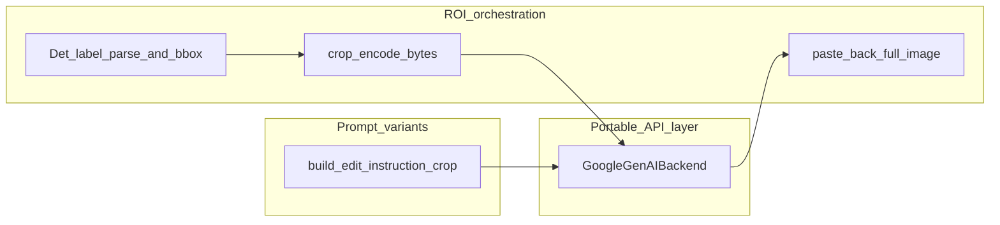

# ROI 流程、API 边界与 scripts/src 重组方案

## 1. 当前 `src/manufacturing_image_edit` 结构（结论）

- **协议层** `[src/manufacturing_image_edit/protocol.py](src/manufacturing_image_edit/protocol.py)`：`ImageEditBackend.edit(image: bytes, context: EditContext, mime_type=...) -> EditResult`，与图像来源无关，利于移植。
    
- **API 实现** `[src/manufacturing_image_edit/backends/google_genai.py](src/manufacturing_image_edit/backends/google_genai.py)`：仅组装 `build_user_parts` + `generate_content`，不做业务几何。
    
- **文案** `[src/manufacturing_image_edit/prompts.py](src/manufacturing_image_edit/prompts.py)`：当前固定要求 _“Output the full edited image”_，面向整图；若把裁剪后的小图送入同一文案，模型可能仍按“整图”理解，一般可行，但更稳妥是增加**裁剪专用**指令（见下），仍属“提示词模块”而非 API 客户端改动。
    

**关于「API 调用模块尽量不动」**：建议将下列文件视为**稳定边界**，不改为依赖 OpenCV/标注文件：

- `backends/google_genai.py`、`google_payload.py`、`response_parse.py`、`mime_sniff.py`、`protocol.py`
    

可在**不碰上述文件**的前提下完成 ROI：编排层传入的 `image` 已是裁剪后的 `bytes`。

---

## 2. ROI 功能应放在哪里（高内聚 / 低耦合）

- **不要**把 `Label.txt` 解析、OpenCV 贴图写进 `GoogleGenAIBackend`（会污染可移植层、并引入训练数据格式与云 API 的硬耦合）。
    
- **推荐**：在同一仓库内二选一（或组合）：
    
    - **方案 A（推荐）**：在 `[src/manufacturing_image_edit/](src/manufacturing_image_edit/)` 下新增 `roi_workflow.py`（或 `pipeline_roi.py`），对外提供例如 `edit_image_with_label_roi(...)`：读原图 → 解析标注 → 算 ROI → 调 `backend.edit` → 贴回。依赖**共享**的标注解析包（见第 4 节）。
        
    - **方案 B**：新建独立小包 `src/ocr_label_kit/`（仅几何 + Label I/O），`manufacturing_image_edit` 只 import 其纯函数；若未来完全不带 Gemini 发布，可单独拆 wheel。
        

**Token 与质量权衡**（需在实现时显式处理）：

- 裁剪 ROI 可显著减少 **图像 token**。
    
- 若仍发送与整图相同的“找标签旁序列号”长提示，**文本 token** 节省有限；裁剪场景下建议在 `[prompts.py](src/manufacturing_image_edit/prompts.py)` 增加 `build_edit_instruction_for_crop(context)`（英文指令），明确“当前图像即为完整工作区，仅替换序列号，输出与输入同尺寸”，避免模型臆造画布外内容。
    
- **贴回**：以轴对齐包围盒裁剪时，贴回为矩形覆盖；若担心接缝，可在边界做小幅羽化（编排层用 numpy/PIL，不进 API 模块）。
    

**ROI 选取规则**（针对你的 `[Label.txt](datasets/input/01/Label.txt)`）：每行 JSON 中含 `製造番号` 与数字序列号两条 `transcription`。默认策略可为：取 `transcription == target_label` 的框与**同一行内**与之配对的序列号框（例如按 x 排序相邻、或取非 label 的那条）的 **union AABB**，再加 `padding`（像素或比例）。若一行多条同类框，应用 CLI 参数限定（如 `--pair-index`）或失败时回退整图（若你明确不要 fallback，则严格报错即可）。

**Batch**：`[batch_google.py](src/manufacturing_image_edit/batch_google.py)` 当前按整图 `read_bytes`。ROI 批处理可选：在 CSV 增加可选列 `label_file` / `label_line_key`，或在编排阶段预生成裁剪后的临时图再交给现有 batch——二者择一，避免重复实现两套 batch 逻辑。

---

## 3. `scripts` 与 `src` 重组建议

**现状**：

- `[scripts/image_edit_serial.py](scripts/image_edit_serial.py)`：仅 `sys.path` 注入 + 调用 `manufacturing_image_edit.cli`，合理保留为入口。
    
- `[scripts/lib/common.py](scripts/lib/common.py)`、`[scripts/lib/paddleocr_tools.py](scripts/lib/paddleocr_tools.py)`：可迁移为 `src` 下正式包。
    
- `[scripts/augmentation/](scripts/augmentation/)`：大体积逻辑（`[augment.py](scripts/augmentation/augment.py)`、`[augment_det.py](scripts/augmentation/augment_det.py)`、`split` 等）应迁入 `src`，脚本目录只保留薄封装。
    

**推荐包名**（与 `[pyproject.toml](pyproject.toml)` 中项目名 `ocr-train-workspace` 对齐）：例如 `ocr_workspace`（或 `train_scripts`，择一后全文统一）。

|   |   |
|---|---|
|迁出路径|建议目标|
|`scripts/lib/common.py`|`src/ocr_workspace/common.py`|
|`scripts/lib/paddleocr_tools.py`|`src/ocr_workspace/paddleocr_tools.py`|
|`scripts/augmentation/*.py`|`src/ocr_workspace/augmentation/`|
|`scripts/eval_model.py` 等|主体逻辑迁入 `src/ocr_workspace/...`，`scripts/` 保留 10～30 行 `python -m ocr_workspace...` 式入口|

**配置变更**：在 `[pyproject.toml](pyproject.toml)` 的 `[tool.setuptools.packages.find]` 中把 `include` 从仅 `manufacturing_image_edit*` 扩展为包含 `ocr_workspace*`（或选定包名），并更新所有 `sys.path`/`from augment import` 等**相对脚本目录的 import**，改为包内相对导入或 `python -m`。

**重复代码**：`[scripts/test_infer.py](scripts/test_infer.py)` 与 `[scripts/testing/test_infer.py](scripts/testing/test_infer.py)` 行数不同，**不是**简单重复；重组时应合并为 `src` 中单一模块 + 一个入口脚本，避免长期双份维护。

---

## 4. 与「之前 script 里 ROI」相关的结论与去重

- **仓库内（不含 `third_party`）没有**现成的“按 `Label.txt` 的 `points` 做几何裁剪再贴回”的实现。
    
- **已有且可抽取的重复**：`[scripts/augmentation/augment_det.py](scripts/augmentation/augment_det.py)` 中的 `_read_det_labels`（仅解析 tab + JSON，按 `Path.name` 索引）。
    
- **建议新建** `src/ocr_workspace/det_label_io.py`（名称可调整）提供：
    
    - `parse_label_txt_line` / `load_label_txt`（返回结构化类型，如 `TypedDict` 或 pydantic 模型，满足 mypy）
        
    - `points_to_aabb`、`union_aabbs`、`aabb_with_padding`（纯函数，无 I/O）
        
- 然后 **删除** `DetectionAugmentor._read_det_labels` 内联实现，改为调用上述模块（行为保持一致：仍用 `Path(img_path).name` 作为 key 时注意与 `Label.txt` 中路径前缀一致，当前数据为 `01/board_01_1.JPG` 形式）。
    

这样 ROI 编排、数据增强、未来其他工具**共用同一套解析与几何**，避免三处复制。

---

## 5. 实施顺序（建议）

1. 新增 `ocr_workspace.det_label_io`（解析 + AABB/union），补单元测试（小样本 `Label.txt` 片段）。
    
2. 重构 `augment_det`（迁入 `src` 后）改用 `det_label_io`，删除旧 `_read_det_labels`。
    
3. 增加 `prompts.build_edit_instruction_for_crop`；新增 `roi_workflow`（或等价模块）与 CLI 子命令（如 `sync --label-file ... --roi`），内部仍调用现有 `get_backend_from_settings`。
    
4. 分批迁移 `scripts/augmentation`、`scripts/lib`、训练相关脚本到 `src/ocr_workspace`，每迁一批跑一次现有训练/增强命令做回归。
    
5. 处理 `test_infer` 双文件合并与 README/入口命令更新（仅你要求改文档时再动根 `[README.md](README.md)`）。
    

---

## 6. 风险与依赖

- ROI 流程依赖 `opencv-python-headless` / `numpy`（项目已具备）；`image-edit` extra 仍仅用于 `google-genai` 等，编排层若放在主依赖包中，需保证 `uv sync` 默认环境即可做几何与增强，无需强绑 `image-edit`。
    
- 贴回后分辨率：若 API 返回尺寸与裁剪不一致，需在编排层 **resize 回 ROI 尺寸** 再 paste，否则布局错位。

# ROIフロー、API境界、および scripts/src 再編成案

## 1. 現在の `src/manufacturing_image_edit` の構造

- **プロトコル層** [`src/manufacturing_image_edit/protocol.py`](https://www.google.com/search?q=src/manufacturing_image_edit/protocol.py)：`ImageEditBackend.edit(image: bytes, context: EditContext, mime_type=...) -> EditResult` を定義。画像のソースに依存せず、移植性が高い。
    
- **API実装** [`src/manufacturing_image_edit/backends/google_genai.py`](https://www.google.com/search?q=src/manufacturing_image_edit/backends/google_genai.py)：`build_user_parts` と `generate_content` の組み立てのみを行い、ビジネスロジックとしての幾何学的処理（crop,boosting等）は行わない。
    
- **プロンプト** [`src/manufacturing_image_edit/prompts.py`](https://www.google.com/search?q=src/manufacturing_image_edit/prompts.py)：現在は「Output the full edited image」と要求しており、画像全体を対象としている。crop後の小さな画像を同じプロンプトで処理した場合、モデルが「画像全体」と誤認する可能性がある。多くの場合機能するが、より安全な方法はcrop専用の指示を追加することである（後述）。これはあくまで「プロンプトモジュール」の範疇であり、APIクライアント側の変更ではない。
    

## 2. ROI機能の配置場所（高凝集 / 低結合）

`Label.txt`の解析やOpenCVでの貼り戻し処理を `GoogleGenAIBackend` の中に記述してはならない（移植可能なレイヤーを汚染し、学習データのフォーマットとクラウドAPIとの間にハードコーディングによる密結合を招くため）。

 [`src/manufacturing_image_edit/`](https://www.google.com/search?q=src/manufacturing_image_edit/) 配下に `roi_workflow.py`（または `pipeline_roi.py`）を新設し、外部に `edit_image_with_label_roi(...)` などを提供する：原画像読み込み → アノテーション解析 → ROI計算 → `backend.edit` 呼び出し → 貼り戻し。共有のアノテーション解析パッケージに依存する（セクション4参照）。

**トークン数と品質のトレードオフ（実装時の明示的な対応が必要）:**

- ROIクロップにより、**画像トークンを大幅に削減**できる。
    
- ただし、画像全体と同じ「ラベル横のシリアル番号を探せ」といった長いプロンプトを送信すると、テキストトークンの削減効果は限定的になる。クロップシナリオでは、[`prompts.py`](https://www.google.com/search?q=src/manufacturing_image_edit/prompts.py) に `build_edit_instruction_for_crop(context)`（英語の指示）を追加し、「現在の画像が完全なワークスペースであり、シリアル番号のみを置換し、入力と同サイズで出力せよ」と明確に指示することで、モデルがキャンバス外のコンテンツを捏造するのを防ぐことを推奨する。
    
- **貼り戻し (Paste back):** 軸並行境界ボックス（AABB）でクロップした場合、矩形領域として貼り戻される。境界の継ぎ目が気になる場合は、境界部分にわずかなフェザリング（ぼかし）処理を行う（オーケストレーション層にてnumpy/PILを使用し、APIモジュールには入れない）。

## 3. `scripts` と `src` の再編成案

**現状:**

- [`scripts/image_edit_serial.py`](https://www.google.com/search?q=scripts/image_edit_serial.py): `sys.path`の注入と `manufacturing_image_edit.cli` の呼び出しのみ。エントリーポイントとしての維持は妥当。
    
- [`scripts/lib/common.py`](https://www.google.com/search?q=scripts/lib/common.py)、[`scripts/lib/paddleocr_tools.py`](https://www.google.com/search?q=scripts/lib/paddleocr_tools.py): `src` 配下の正式なパッケージに移行可能。
    
- [`scripts/augmentation/`](https://www.google.com/search?q=scripts/augmentation/): 大規模なロジック（[`augment.py`](https://www.google.com/search?q=scripts/augmentation/augment.py)、[`augment_det.py`](https://www.google.com/search?q=scripts/augmentation/augment_det.py)、split 等）は `src` 内に移行し、スクリプトディレクトリには薄いラッパーのみを残すべき。
    

**推奨パッケージ名:**（[`pyproject.toml`](https://www.google.com/search?q=pyproject.toml) 内のプロジェクト名 `ocr-train-workspace` に揃える）：例えば `ocr_workspace`（または `train_scripts`、いずれかを選択し全体で統一）。

|**移行元パス**|**推奨される移行先**|
|---|---|
|`scripts/lib/common.py`|`src/ocr_workspace/common.py`|
|`scripts/lib/paddleocr_tools.py`|`src/ocr_workspace/paddleocr_tools.py`|
|`scripts/augmentation/*.py`|`src/ocr_workspace/augmentation/`|
|`scripts/eval_model.py` 等|メインロジックを `src/ocr_workspace/...` に移行し、`scripts/` には10〜30行の `python -m ocr_workspace...` 形式のエントリーポイントを残す|

- **設定の変更:** [`pyproject.toml`](https://www.google.com/search?q=pyproject.toml) の `[tool.setuptools.packages.find]` において、`include` を `manufacturing_image_edit*` のみから `ocr_workspace*`（または選定したパッケージ名）を含むように拡張する。また、スクリプトディレクトリ相対で行っていた `sys.path` や `from augment import` 等のインポートをすべてパッケージ内の相対インポートまたは `python -m` 形式に更新する。
    
- **重複コード:** [`scripts/test_infer.py`](https://www.google.com/search?q=scripts/test_infer.py) と [`scripts/testing/test_infer.py`](https://www.google.com/search?q=scripts/testing/test_infer.py) は行数が異なり単純な重複ではない。再編成時に「`src`内の単一モジュール + 1つのエントリーポイントスクリプト」に統合し、二重メンテナンスの状態を解消するべきである。
    
## 4. TODO

- [ ] **Crop処理のテスト実施:** 現時点では、Cropに関する実装コードのテストが未実施であるため、単体テストおよび動作確認を行う。
    
- [ ] **重複コードの削除と `scripts` / `src` の構造整理:** Crop部分の実装において、過去のコードと重複している箇所があるため、整理して不要なコードを削除（リファクタリング）する。また、これまでスクリプト（`scripts`）とソースコード（`src`）の境界・切り分けが曖昧であったため、今回の改修に合わせて全体のディレクトリ構造とモジュール配置を適切に整理し直す。
      
**分解能改善」**（ぶんかいのう かいぜん）在日语的图像处理、医疗或工业CT领域，意思就是：**“分辨率提升”** 或 **“提高清晰度”**。

我们可以把它拆开来看：

- **分解能（ぶんかいのう）：** 分辨率（Resolution）。指区分两个相邻微小结构的能力。
    
- **改善（かいぜん）：** 提升、改善。
    

联系到您之前提到的 **“CT图像的SN改善与分解能改善”**：

- **SN改善（信噪比提升）：** 对应的是 **降噪（Denoising）**，也就是把画面里的噪点/雪花点去掉。
    
- **分解能改善：** 对应的是 **超分辨率（Super-Resolution, SR）** 或 **锐化（Sharpening）**，也就是把模糊的边缘变清晰，让原本看不清的微小缺陷（比如细微的裂纹、气孔）显现出来。
    

所以，在您的AI项目中，如果提到“分解能改善的AI”，通常指的就是**超分辨率网络**（比如基于 ESRGAN 或 Diffusion 的模型），目的是把低分辨率（Low-Res）的图像放大并还原成高分辨率（High-Res）的细节。